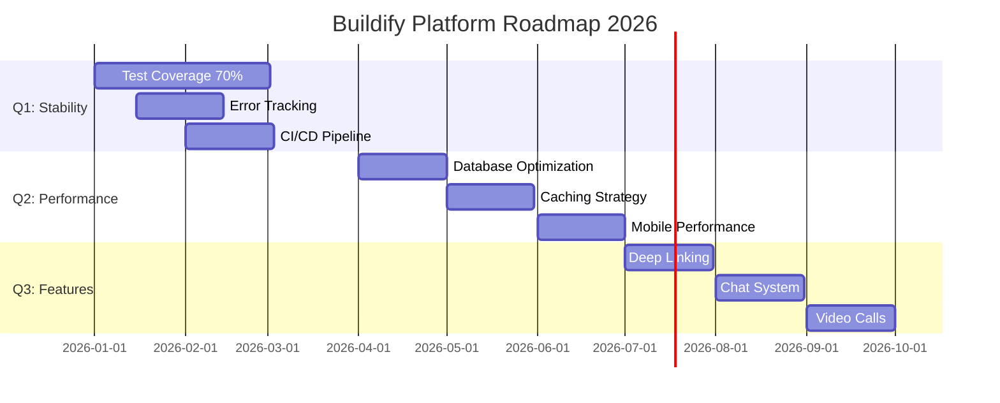

# 🏗️ Welcome to Buildify Platform!

<div align="center">
  
  
  
  <br>
  
  [](https://git.io/typing-svg)
  
</div>

[](LICENSE)
[](backend/)
[](mobile/)
[](https://www.postgresql.org/)

## 🌟 About Buildify

**Buildify Platform** is an enterprise-grade marketplace that revolutionizes how customers find and hire construction professionals. We combine modern technology, transparent processes, and intelligent automation to create a trusted ecosystem.

### 🎯 Key Metrics

- 🚀 **350+ API Endpoints** - Comprehensive RESTful API
- 📱 **47+ Mobile Screens** - Full-featured native apps
- 💾 **100+ DB Migrations** - Robust data schema
- 🎨 **60+ Custom Components** - Beautiful UI library
- 👥 **4 User Types** - Multi-role ecosystem
- 🌐 **7 Languages** - Global reach

## ⚡ Core Features

<table>
<tr>
<td width="50%">

### 🎯 Order Management
- ✅ Create detailed requests
- ✅ Receive executor responses
- ✅ Compare proposals
- ✅ Track progress
- ✅ Mutual completion
- ✅ Review system

</td>
<td width="50%">

### 💳 Payments & Subscriptions
- 💰 Wallet system (AED)
- 💳 Stripe integration
- 📊 4-tier subscriptions
- 🎯 Usage limits
- 💸 Escrow payments
- 📈 Transaction history

</td>
</tr>
<tr>
<td width="50%">

### 🤖 AI Integration
- 🎨 GPT-4 design generation
- 🖼️ DALL-E 3 visualizations
- ⚡ Async processing
- 🔄 Generate variations
- 💾 Save & share

</td>
<td width="50%">

### 🔔 Real-time
- 📡 WebSocket (Soketi)
- 📲 Push (FCM)
- 💬 In-app notifications
- ✉️ Email alerts
- 🔴 Live updates

</td>
</tr>
</table>

## 🛠️ Technology Stack

<div align="center">
  
</div>

### Backend
```yaml
Framework: Laravel 11 (PHP 8.2+)
Database: PostgreSQL 15
Cache: Redis 7
WebSocket: Soketi
Auth: Laravel Sanctum
Payments: Stripe + Cashier
AI: OpenAI GPT-4
Admin: Orchid Platform
```

### Mobile
```yaml
Framework: React Native 0.75.3
State: Redux + Persist
Navigation: React Navigation 6
API: Axios
Real-time: Pusher.js
i18n: i18next (7 langs)
Push: Firebase FCM
Maps: RN Maps
```

## 🚀 Quick Start

### Docker (Recommended)

```bash
git clone https://github.com/TheMacroeconomicDao/buildify-platform.git
cd buildify-platform
make up
make backend-migrate
```

Access at: http://localhost:3000

### Manual Setup

**Backend:**
```bash
cd backend
composer install
cp .env.example .env
php artisan key:generate
php artisan migrate
php artisan serve
```

**Mobile:**
```bash
cd mobile
npm install
npm run android  # or npm run ios
```

## 👥 User Types

| Type | Role | Key Features |
|------|------|-------------|
| 👤 **Customer** (Type 1) | Order creator | Create orders, hire executors, pay & review |
| 🔨 **Executor** (Type 0) | Service provider | Browse orders, submit bids, showcase portfolio |
| 🤝 **Mediator** (Type 2) | Deal manager | Manage transactions, quality control, earn commission |
| 👑 **Admin** (Type 99) | Platform admin | User management, verification, analytics |

## 📈 Roadmap



## 📚 Documentation

- 📋 [Technical Overview](docs/TECHNICAL_OVERVIEW.md)
- 🏛️ [Architecture Analysis](docs/ARCHITECTURE_ANALYSIS.md)  
- 🚀 [Quick Start Guide](docs/guides/QUICK_START.md)
- 🤝 [Contributing Guidelines](CONTRIBUTING.md)
- 📝 [Changelog](CHANGELOG.md)

## 🏅 Quality Score

| Category | Score | Status |
|----------|-------|--------|
| Backend | 7.5/10 | ✅ Production-ready |
| Mobile | 7.0/10 | ✅ Production-ready |
| Overall | 7.2/10 | ✅ Solid foundation |

---

<div align="center">
  
  
  
  <sub><b>🏗️ Buildify Platform © 2025 | MIT License | Made with ❤️ by TheMacroeconomicDao</b></sub>
  
  <br><br>
  
  ⭐ **Star us on GitHub!**
  
  [](https://github.com/TheMacroeconomicDao/buildify-platform/stargazers)
  
</div>
